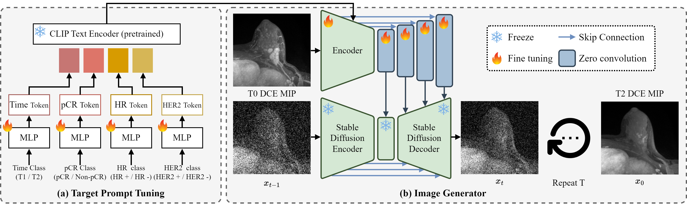

# Neoadjuvant Chemotherapy Simulation for Breast Cancer MRI via Diffusion Model


## Overview

This repository contains the code for Neoadjuvant Chemotherapy Simulation for Breast Cancer MRI via Diffusion Model.

The model architecture is illustrated below: 




Our code was written by applying ControlNet. We would like to thank those who have shared their code.

- [Adding Conditional Control to Text-to-Image Diffusion Models](https://github.com/lllyasviel/ControlNet?tab=readme-ov-file). 


## Enviroment

First create a new conda environment

```shell
conda env create -f environment.yaml
conda activate NACsim
```


## Pretrained model

All pretrained ControlNet can be downloaded from [Hugging Face page](https://huggingface.co/thibaud/controlnet-sd21/tree/main). 


## Train

```shell
python train.py
```


## Citation
